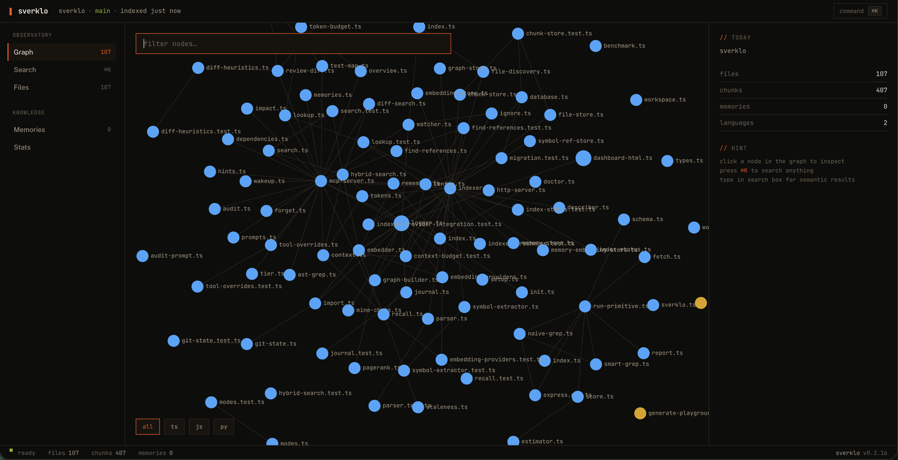

# Sverklo

_Sverklo_ (Russian: **сверкло**, _SVERK-lo_) — archaic past tense of "сверкнуть," to flash or gleam. Code intelligence that illuminates your repo so your AI assistant stops guessing.

[](https://www.npmjs.com/package/sverklo)
[](https://www.npmjs.com/package/sverklo)
[](https://github.com/sverklo/sverklo)
[](LICENSE)
[](#)

## Stop re-explaining your codebase to your AI.

Sverklo is a local-first code intelligence MCP server that gives **Claude Code, Cursor, Windsurf, VS Code, JetBrains, and Google Antigravity** the same mental model of your repo that a senior engineer has. Hybrid semantic search, symbol-level blast-radius analysis, diff-aware PR review, and memory pinned to git state — running entirely on your laptop.

<table>
<tr>
<td align="center"><b>20</b><br/>tools your agent actually uses</td>
<td align="center"><b>&lt; 2 s</b><br/>to index a 1,700-file monorepo</td>
<td align="center"><b>0 bytes</b><br/>of your code leave your machine</td>
</tr>
</table>

```bash
npm install -g sverklo
cd your-project && sverklo init
```

`sverklo init` auto-detects your installed AI coding agents, writes the right MCP config files, appends sverklo instructions to your `CLAUDE.md`, and runs `sverklo doctor` to verify the setup. MIT licensed. Zero config. No API keys.

> **First 5 minutes:** see [`FIRST_RUN.md`](FIRST_RUN.md) for three scripted prompts that demonstrate the tools sverklo adds that grep can't replace.

---

## Grep vs Sverklo — the same question, side by side

Every one of these is a query a real engineer asked a real AI assistant last week. Grep gives you lines. Sverklo gives you a ranked answer.

| The question | With Grep | With Sverklo |
|---|---|---|
| "Where is auth handled in this repo?" | `grep -r 'auth' .` → 847 matches across tests, comments, unrelated vars, and one 2021 TODO | `sverklo_search "authentication flow"` → top 5 files ranked by PageRank: middleware, JWT verifier, session store, login route, logout route |
| "Can I safely rename `BillingAccount.charge`?" | `grep '\.charge('` → 312 matches polluted by `recharge`, `discharge`, `Battery.charge` fixtures | `sverklo_impact BillingAccount.charge` → 14 real callers, depth-ranked, with file paths and line numbers |
| "Is this helper actually used anywhere?" | `grep -r 'parseFoo' .` → 4 matches in 3 files. Are any real, or just string mentions? Read each one. | `sverklo_refs parseFoo` → 0 real callers. Zero. Walk the symbol graph, not the text. Delete the function. |
| "What's load-bearing in this codebase?" | `find . -name '*.ts' \| xargs wc -l \| sort` → the biggest files. Not the most important ones. | `sverklo_overview` → PageRank over the dep graph. The files the rest of the repo depends on, not the ones someone wrote too much code in. |
| "Review this 40-file PR — what should I read first?" | Read them in the order git diff printed them | `sverklo_review_diff` → risk-scored per file (touched-symbol importance × coverage × churn), prioritized order, flagged production files with no test changes |

If the answer to your question is "exact string X exists somewhere," grep wins. Use grep. If the answer is "which 5 files actually matter here, ranked by the graph," you need sverklo.

---

## When to reach for sverklo — and when not to

We're honest about this. Sverklo isn't a magic 5× speedup and it doesn't replace grep. It's a sharper tool for specific jobs.

### The two tools that earn their keep every time

If you only remember two, remember these. They deliver value that plain text search structurally cannot:

1. **`sverklo_refs`** — proves dead code with certainty (zero references across the whole symbol graph, not just the files grep happened to scan) and answers "is this actually used anywhere?" in one call.
2. **`sverklo_audit`** — one structural pass that surfaces god classes, hub files, and suspicious concentrations of complexity without you having to guess the right regex.

### When grep is still the right tool

Sverklo shines when **you don't know exactly what to search for**. When you do, grep is fine and we'll tell you so:

- **Exact string matching** — "does this literal string exist anywhere?" → `Grep` is faster and more reliable.
- **Reading file contents** — only `Read` does this. Sverklo isn't a file reader.
- **Build and test verification** — only `Bash` runs `npm test` or `gradle check`.
- **Focused single-file diffs** — for a signature change in one file, `git diff` + `Read` is hard to beat.
- **Small codebases (under ~50 source files)** — the indexing and MCP roundtrip overhead doesn't pay off at that size. Just read everything. Sverklo starts earning its keep around 100+ files and really shines above 500.

If a launch post tells you a tool is great for everything, close the tab.

---

## Twenty tools your agent actually uses

Grouped by job. Every tool runs locally, every tool is free.

### Search — find code without knowing the literal string
| Tool | What |
|------|------|
| `sverklo_search` | Hybrid BM25 + ONNX vector + PageRank, fused with Reciprocal Rank Fusion |
| `sverklo_overview` | Structural codebase map ranked by PageRank importance |
| `sverklo_lookup` | Find any function, class, or type by name (typo-tolerant) |
| `sverklo_context` | One-call onboarding — combines overview, code, and saved memories |
| `sverklo_ast_grep` | Structural pattern matching across the AST, not just text |

### Impact — refactor without the regression
| Tool | What |
|------|------|
| `sverklo_impact` | Walk the symbol graph, return ranked transitive callers (the real blast radius) |
| `sverklo_refs` | Find all references to a symbol, with caller context |
| `sverklo_deps` | File dependency graph — both directions, importers and imports |
| `sverklo_audit` | Surface god nodes, hub files, dead code candidates in one call |

### Cross-repo impact analysis (v0.4.0+)

Link multiple projects into a workspace and trace symbol impact across repo boundaries:

```bash
# Link multiple projects into a workspace
sverklo workspace init myapp ./api ./frontend ./cms

# Index cross-repo relationships
sverklo workspace index myapp
```

Then ask your agent:

```
sverklo_impact symbol:"User.email" cross_repo:true
```

This walks the symbol graph across all linked repos and returns the full blast radius — which API routes, frontend components, and CMS templates touch `User.email`, ranked by depth. Currently GraphQL-first (schema stitching and federation are resolved automatically). REST/OpenAPI support is next.

### Review — diff-aware MR review with risk scoring
| Tool | What |
|------|------|
| `sverklo_review_diff` | Risk-scored review of `git diff` — touched-symbol importance × coverage × churn |
| `sverklo_test_map` | Which tests cover which changed symbols; flag untested production changes |
| `sverklo_diff_search` | Semantic search restricted to the changed surface of a diff |

### Memory — bi-temporal, git-aware, never stale
| Tool | What |
|------|------|
| `sverklo_remember` | Save decisions, patterns, invariants — pinned to the current git SHA |
| `sverklo_recall` | Semantic search over saved memories with staleness detection |
| `sverklo_memories` | List all memories with health metrics (still valid / stale / orphaned) |
| `sverklo_forget` | Delete a memory |
| `sverklo_promote` / `sverklo_demote` | Move memories between tiers (project / global / archived) |

### Index health
| Tool | What |
|------|------|
| `sverklo_status` | Index health check, file counts, last update |
| `sverklo_wakeup` | Warm the index after a long pause; incremental refresh |

## Example prompts that showcase sverklo

Copy-paste these into Claude Code, Cursor, or Windsurf on any indexed project. Each one exercises a tool that plain text search can't replicate.

- **"Find everything that would break if I rename `UserRepository.findActive`. Rank by depth, show me the riskiest 5 callers first."**
- **"Is `parseFoo` actually used anywhere in this repo, or is it dead code I can delete?"**
- **"What are the top 10 most structurally important files in this codebase? Don't count test files."**
- **"Review the current git diff. What should I read first? Which changes touch untested production code?"**
- **"I'm onboarding to this repo. Give me a 5-minute mental model: what are the god classes, what are the hub files, what's dead?"**
- **"Save a decision: we use Postgres advisory locks instead of Redis for cross-worker mutexes because of our existing operational familiarity. Pin it to the current SHA."**
- **"What did we decide about rate limiting the public API? Check saved memories first, then the actual code."**

If your agent isn't reaching for sverklo tools on prompts like these, check `sverklo doctor` or verify your CLAUDE.md has the sverklo section (re-run `sverklo init` — it's safe).

## Two ready-to-paste workflow prompts

For deeper hybrid workflows, sverklo ships two battle-tested prompt templates you can paste into any agent. They encode the "prefer sverklo for discovery, fall back to grep for exact patterns" approach that consistently produces the best results:

```bash
sverklo audit-prompt    # full codebase audit — 4-phase workflow
sverklo review-prompt   # pull/merge request review with blast-radius analysis
```

Pipe the output into `pbcopy` / `xclip` and paste into Claude Code, or save it to a file your agent can load.

## How It Works

```
Your code → Parse (10 languages) → Embed (ONNX, local)
                                  → Build dependency graph
                                  → Compute PageRank
                                        ↓
Agent query → BM25 text search ──┐
            → Vector similarity ──┼→ RRF fusion → Token-budgeted response
            → PageRank boost ────┘
```

1. **Parses** your codebase into functions, classes, types (TS, JS, Python, Go, Rust, Java, C, C++, Ruby, PHP)
2. **Embeds** code using all-MiniLM-L6-v2 ONNX model (384d vectors, fully local)
3. **Builds** a dependency graph and computes PageRank (structurally important files rank higher)
4. **Searches** using hybrid BM25 + vector similarity + PageRank, fused via Reciprocal Rank Fusion
5. **Remembers** decisions and patterns across sessions, linked to git state
6. **Watches** for file changes and updates incrementally

## Quick Start

```bash
npm install -g sverklo
cd your-project
sverklo init
```

This creates `.mcp.json` at your project root (the only file Claude Code reads for project-scoped MCP servers) and appends sverklo instructions to your `CLAUDE.md`. Safe to re-run.

If sverklo doesn't appear in Claude Code's `/mcp` list after restart, run:
```bash
sverklo doctor
```
This diagnoses MCP setup issues — checks the binary, the model, the config file location, the handshake, and tells you exactly what's wrong.

### Cursor / Windsurf / VS Code
These IDEs use their own MCP config locations. Use the **full binary path** to avoid PATH resolution issues in spawned subprocesses:
```json
{
  "mcpServers": {
    "sverklo": {
      "command": "/full/path/to/sverklo",
      "args": ["."]
    }
  }
}
```
Find the path with `which sverklo`. Add to:
- **Cursor:** `.cursor/mcp.json`
- **Windsurf:** `~/.windsurf/mcp.json`
- **VS Code:** `.vscode/mcp.json`
- **JetBrains:** Settings → Tools → MCP Servers

### Google Antigravity
Antigravity uses a **global** MCP config file (no per-project config — known limitation, see [Google forum](https://discuss.ai.google.dev/t/support-for-per-workspace-mcp-config-on-antigravity/111952)). `sverklo init` writes it for you if Antigravity is installed, otherwise edit the file by hand:

`~/.gemini/antigravity/mcp_config.json` (Windows: `C:\Users\<USER>\.gemini\antigravity\mcp_config.json`)

```json
{
  "mcpServers": {
    "sverklo": {
      "command": "/full/path/to/sverklo",
      "args": ["/absolute/path/to/your/project"]
    }
  }
}
```

Restart Antigravity after editing. To verify, open the side panel → **MCP Servers** → **Manage MCP Servers** — sverklo should appear in the list. Because the config is global, if you work on multiple projects you'll need to either re-run `sverklo init` from each (it rewrites the path) or run a separate sverklo instance per project under different keys (`sverklo-projA`, `sverklo-projB`).

### Any MCP Client
```bash
npx sverklo /path/to/your/project
```

### Dashboard
```bash
npx sverklo ui .
```
Opens a web dashboard at `localhost:3847` — browse indexed files, search playground, memory viewer, dependency graph.

> **First run:** The ONNX embedding model (~90MB) downloads automatically. Takes ~30 seconds on first launch, then instant.

## The web dashboard (`sverklo ui`)

Sverklo ships with a local web dashboard that gives you a visual window into the index the MCP tools work against. It's the fastest way to verify the index looks right, explore the structural graph of an unfamiliar codebase, or audit saved memories.

```bash
sverklo ui .
```

Opens `http://localhost:3847` in your browser. Everything runs locally — the dashboard reads straight from the SQLite index file at `~/.sverklo/<project-hash>/index.db`. No cloud, no network calls, no server to stand up.



What you can see:

- **Overview** — PageRank-ranked file list, language breakdown, chunk count, memory health
- **File browser** — every indexed file with its chunks (functions, classes, types), import graph (both directions), and PageRank score
- **Search playground** — run `sverklo_search` queries interactively and see the ranked hits, scores, and PageRank contribution side-by-side. Faster than typing queries into your agent when you're debugging a failing search.
- **Dependency graph** — the whole repo's file-level dependency graph, nodes colored by language, sized by PageRank. Pan and zoom. The fastest way to find "the files that matter" in a repo you've never seen.
- **Memory viewer** — all saved memories, grouped by tier (core / archive), with their git SHAs, tags, and staleness flags
- **Memory timeline** — bi-temporal view showing invalidated memories alongside active ones, with the SHAs where each one was superseded. Click through to see which memory replaced which.

The dashboard is read-only — nothing you do here changes the index. Use the MCP tools from your AI agent for that. Think of the dashboard as the "inspect" view of the tools you're already using.

Keep it open in a tab alongside Claude Code or Cursor while you work. When a tool call returns a confusing result, click through to see exactly what the index thinks the codebase looks like.

## Performance

Real measurements on real codebases. Every number below is reproducible with one command:

```bash
git clone https://github.com/sverklo/sverklo && cd sverklo
npm install && npm run build
npm run bench   # clones gin/nestjs/react, runs the full suite
```

Full methodology in [`BENCHMARKS.md`](./BENCHMARKS.md). The detailed on-disk format is documented in [`docs/index-format.md`](./docs/index-format.md).

| Repo | Files | Cold index | Search p95 | Impact analysis | DB size |
|---|---:|---:|---:|---:|---:|
| [gin-gonic/gin](https://github.com/gin-gonic/gin) | 99 | 10 s | 12 ms | 0.75 ms | 4 MB |
| [nestjs/nest](https://github.com/nestjs/nest) | 1,709 | 22 s | 14 ms | 0.88 ms | 11 MB |
| [facebook/react](https://github.com/facebook/react) | 4,368 | 152 s | 26 ms | 1.18 ms | 67 MB |

- **Search latency stays under 26 ms p95** even on a 4k-file React monorepo
- **Impact analysis is sub-millisecond** on every repo we tested — it's an indexed SQL join, not a string scan
- **Cold-start indexing is linear in chunks** (~7 ms/chunk on Apple Silicon). Pay it once per project; incremental refresh after that only re-processes changed files
- **Steady-state RAM is ~200 MB** after indexing finishes. Peak during indexing is 400–700 MB while the embedder batches chunks
- **Languages:** 10 (TS, JS, Python, Go, Rust, Java, C, C++, Ruby, PHP)
- **Dependencies:** zero config, zero API keys, zero cloud calls (after the one-time ~90 MB ONNX model download)

## Troubleshooting

Most setup issues fall into one of five buckets. Run `sverklo doctor` first — it diagnoses 90 % of them automatically. If you still need to dig, here's the manual playbook:

**Sverklo doesn't appear in Claude Code's `/mcp` list after restart.**
1. Confirm the binary is on PATH: `which sverklo` (should print an absolute path)
2. Confirm `.mcp.json` exists at the project root: `cat .mcp.json`
3. Fully quit and restart Claude Code (not just reload the window) — MCP configs are read once on startup
4. Check the sverklo MCP log in Claude Code: `View → Output → Model Context Protocol`

**`sverklo init` wrote a config but the agent still can't find it.**
- Cursor / Windsurf / VS Code use their own MCP config paths. See [Cursor / Windsurf / VS Code](#cursor--windsurf--vs-code) below — the config goes in `.cursor/mcp.json`, `~/.windsurf/mcp.json`, or `.vscode/mcp.json` respectively, not `.mcp.json`.
- Antigravity uses a **global** config at `~/.gemini/antigravity/mcp_config.json`. See [Google Antigravity](#google-antigravity).

**"Failed to start sverklo" / the handshake fails.**
- Confirm Node ≥ 20: `node --version`
- Try running the server manually to see the error directly: `sverklo .`
- Enable debug logging: `SVERKLO_DEBUG=1 sverklo .`
- If the ONNX model download failed, re-run it: `sverklo setup`

**Index feels wrong or stale.**
- Check status: `sverklo doctor` or call `sverklo_status` in your agent
- Force a rescan: delete the index at `~/.sverklo/<project-hash>/` and restart the server
- Large binary files are skipped by default (>1 MB). If you need them indexed, override via `.sverkloignore`

**Slow queries.**
- `npm run bench:latency` runs the MCP roundtrip profiler against your current build and prints per-tool p50/p95. Use it to confirm whether the slowdown is in a specific tool or a system-wide cost.
- Large codebases take time to cold-index — but after that, incremental updates should be <10 ms per file event.

Still stuck? File an issue with the output of `sverklo doctor` attached. We triage within a couple days.

## Why not... (as of 2026-04)

| Alternative | Local | OSS | Code search | Symbol graph | Memory | MR review | Cost |
|---|---|---|---|---|---|---|---|
| **Sverklo** | ✓ | ✓ MIT | ✓ hybrid + PageRank | ✓ | ✓ git-aware | ✓ risk-scored | $0 |
| Built-in grep / Read | ✓ | ✓ | text only | ✗ | ✗ | ✗ | $0 |
| [Cursor's @codebase](https://docs.cursor.com/context/codebase-indexing) | ✗ cloud | ✗ | ✓ | partial | ✗ | ✗ | with Cursor sub |
| [Sourcegraph Cody](https://sourcegraph.com/cody) | ✗ cloud | ✗ source-available | ✓ | ✓ | ✗ | partial | $9–19/dev/mo |
| [Continue.dev](https://continue.dev) | partial | ✓ | ✓ basic | ✗ | ✗ | ✗ | $0 |
| [Claude Context (Zilliz)](https://github.com/zilliztech/claude-context) | ✗ Milvus | ✓ | ✓ vector only | ✗ | ✗ | ✗ | $0 + Milvus |
| [Aider repo-map](https://aider.chat/docs/repomap.html) | ✓ | ✓ | ✗ | ✓ basic | ✗ | ✗ | $0 |
| [Greptile](https://greptile.com) | ✗ cloud | ✗ | ✓ | ✓ | ✗ | ✓ | $30/dev/mo |
| [Augment](https://augmentcode.com) | ✗ cloud | ✗ | ✓ | ✓ | ✗ | partial | $20–200/mo |
| [claude-mem](https://github.com/themanojdesai/claude-mem) | ✓ | ✓ | ✗ | ✗ | ✓ ChromaDB | ✗ | $0 |

Sverklo is the only tool that combines **hybrid code search + symbol graph + memory + diff-aware review** in one local-first MCP server.

## Configuration

| Setting | Location |
|---------|----------|
| Model files | `~/.sverklo/models/` (auto-downloaded) |
| Index database | `~/.sverklo/<project>/index.db` |
| Project config | `.sverklo.yaml` in project root |
| Custom ignores | `.sverkloignore` in project root |
| Debug logging | `SVERKLO_DEBUG=1` |

### `.sverklo.yaml` (v0.3.0+)

Drop a `.sverklo.yaml` in your project root to tune indexing and search behavior per-repo:

```yaml
# .sverklo.yaml — customize Sverklo's behavior
weights:
  - glob: "src/core/**"
    weight: 2.0          # boost core modules in search ranking
  - glob: "src/generated/**"
    weight: 0.1          # suppress generated code
  - glob: "vendor/**"
    weight: 0.2

ignore:
  - "*.generated.ts"
  - ".next/**"

search:
  defaultTokenBudget: 6000
  budgets:
    search: 8000
    audit: 5000
```

**Weights** are multiplicative on PageRank only — they don't affect BM25 or embedding scores. Range is 0.0 to 10.0, last matching glob wins. Use them to boost code you care about and suppress generated or vendored files without fully ignoring them.

**Token budgets** control how much context each tool returns per call. The defaults were raised in v0.3.0 (search: 8000, audit: 5000). Override them here or per-call via the `budget` parameter on any search tool.

## Telemetry

**Off by default.** Sverklo ships zero telemetry until you explicitly run `sverklo telemetry enable`. If you never run that command, sverklo never makes a network call beyond the one-time embedding model download on first run.

If you do opt in, we collect 9 fields per event: a random install ID (generated locally), sverklo version, OS, Node major version, the event type (one of 17 fixed enum values), the tool name when applicable, the outcome (ok/error/timeout), and the duration in ms. Server-side we add a Unix timestamp.

**We never collect:** code, queries, file paths, symbol names, memory contents, git SHAs, branches, repo URLs, IP addresses, hostnames, error messages, language breakdowns, or anything else that could identify you or your codebase.

Every event is mirrored to `~/.sverklo/telemetry.log` **before** the network call so you can `tail -f` it and see exactly what gets sent. The endpoint is a Cloudflare Worker we own at `t.sverklo.com`, the source lives in [`telemetry-endpoint/`](./telemetry-endpoint/), retention is 90 days, and the entire client implementation is one file under 250 lines at [`src/telemetry/index.ts`](./src/telemetry/index.ts).

Read [`TELEMETRY.md`](./TELEMETRY.md) for the full schema, the 17 event types, what we deliberately don't collect, and how to verify it. The design rationale and locked decisions are in [`TELEMETRY_DESIGN.md`](./TELEMETRY_DESIGN.md).

```bash
sverklo telemetry status    # show current state
sverklo telemetry enable    # opt in (interactive, prints schema first)
sverklo telemetry disable   # opt out, permanent per machine
sverklo telemetry log       # show every event that was sent
```

## Open Source, Open Core

The full MCP server is **free and open source** (MIT). All 20 tools, no limits, no telemetry, no "free tier" — that's not where the line is.

**Sverklo Pro** (later this year) adds smart auto-capture of decisions, cross-project pattern learning, and larger embedding models.

**Sverklo Team** (later this year) adds shared team memory and on-prem deployment.

The open-core line is **"Pro adds new things, never gates current things."** Anything in the OSS server today stays in the OSS server forever.

## Links

- [Website](https://sverklo.com)
- [npm](https://www.npmjs.com/package/sverklo)
- [Issues](https://github.com/sverklo/sverklo/issues)

## License

MIT
