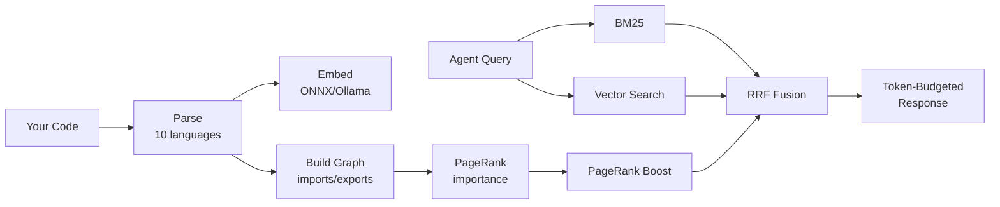

# Sverklo

Local-first code intelligence MCP server. Semantic search, symbol graph, blast-radius analysis, diff-aware PR review, and git-pinned memory for Claude Code, Cursor, Windsurf, and any MCP client.

[](https://www.npmjs.com/package/sverklo)
[](https://www.npmjs.com/package/sverklo)
[](LICENSE)


## The problem

Your AI agent edits `UserService.validate()`. It doesn't know that 47 other functions call it. Breaking changes ship. Tests pass because they mock the dependency.

Sverklo gives your agent the dependency graph, the blast radius, and the risk score — before it writes a single line.

<table>
<tr>
<td align="center"><b>20</b><br/>tools your agent actually uses</td>
<td align="center"><b>&lt; 2 s</b><br/>to index a 1,700-file monorepo</td>
<td align="center"><b>0 bytes</b><br/>of your code leave your machine</td>
</tr>
</table>

```bash
npm install -g sverklo
cd your-project && sverklo init
```

`sverklo init` auto-detects your installed AI coding agents, writes the right MCP config files, appends sverklo instructions to your `CLAUDE.md`, and runs `sverklo doctor` to verify the setup. MIT licensed. Zero config. No API keys.

---

## Grep vs Sverklo — the same question, side by side

Every one of these is a query a real engineer asked a real AI assistant last week. Grep gives you lines. Sverklo gives you a ranked answer.

| The question | With Grep | With Sverklo |
|---|---|---|
| "Where is auth handled in this repo?" | `grep -r 'auth' .` -- 847 matches across tests, comments, unrelated vars, and one 2021 TODO | `sverklo_search "authentication flow"` -- top 5 files ranked by PageRank: middleware, JWT verifier, session store, login route, logout route |
| "Can I safely rename `BillingAccount.charge`?" | `grep '\.charge('` -- 312 matches polluted by `recharge`, `discharge`, `Battery.charge` fixtures | `sverklo_impact BillingAccount.charge` -- 14 real callers, depth-ranked, with file paths and line numbers |
| "Is this helper actually used anywhere?" | `grep -r 'parseFoo' .` -- 4 matches in 3 files. Are any real, or just string mentions? Read each one. | `sverklo_refs parseFoo` -- 0 real callers. Zero. Walk the symbol graph, not the text. Delete the function. |
| "What's load-bearing in this codebase?" | `find . -name '*.ts' \| xargs wc -l \| sort` -- the biggest files. Not the most important ones. | `sverklo_overview` -- PageRank over the dep graph. The files the rest of the repo depends on, not the ones someone wrote too much code in. |
| "Review this 40-file PR — what should I read first?" | Read them in the order git diff printed them | `sverklo_review_diff` -- risk-scored per file (touched-symbol importance x coverage x churn), prioritized order, flagged production files with no test changes |

If the answer to your question is "exact string X exists somewhere," grep wins. Use grep. If the answer is "which 5 files actually matter here, ranked by the graph," you need sverklo.

---

## Works with every MCP editor

| Editor | MCP | Skills | Hooks | Auto-setup |
|--------|:---:|:------:|:-----:|:----------:|
| Claude Code | yes | yes | yes | `sverklo init` |
| Cursor | yes | — | — | `sverklo init` |
| Windsurf | yes | — | — | `sverklo init` |
| Zed | yes | — | — | `sverklo init` |
| VS Code | yes | — | — | manual |
| JetBrains | yes | — | — | manual |
| Antigravity | yes | — | — | `sverklo init` |
| Any MCP client | yes | — | — | `npx sverklo /path` |

---

## Hero tools

| Tool | What it does |
|------|-------------|
| `sverklo_search` | Hybrid BM25 + vector + PageRank search. Find code without knowing the literal string. |
| `sverklo_refs` | All references to a symbol, with caller context. Proves dead code with certainty. |
| `sverklo_impact` | Walk the symbol graph, return ranked transitive callers — the real blast radius. |
| `sverklo_review_diff` | Risk-scored review of `git diff`: touched-symbol importance x coverage x churn. |

[See all 20 tools below.](#full-tool-reference)

<details>
<summary><h2>Full tool reference</h2></summary>

### Search — find code without knowing the literal string
| Tool | What |
|------|------|
| `sverklo_search` | Hybrid BM25 + ONNX vector + PageRank, fused with Reciprocal Rank Fusion |
| `sverklo_overview` | Structural codebase map ranked by PageRank importance |
| `sverklo_lookup` | Find any function, class, or type by name (typo-tolerant) |
| `sverklo_context` | One-call onboarding — combines overview, code, and saved memories |
| `sverklo_ast_grep` | Structural pattern matching across the AST, not just text |

### Impact — refactor without the regression
| Tool | What |
|------|------|
| `sverklo_impact` | Walk the symbol graph, return ranked transitive callers (the real blast radius) |
| `sverklo_refs` | Find all references to a symbol, with caller context |
| `sverklo_deps` | File dependency graph — both directions, importers and imports |
| `sverklo_audit` | Surface god nodes, hub files, dead code candidates in one call |

### Review — diff-aware MR review with risk scoring
| Tool | What |
|------|------|
| `sverklo_review_diff` | Risk-scored review of `git diff` — touched-symbol importance x coverage x churn |
| `sverklo_test_map` | Which tests cover which changed symbols; flag untested production changes |
| `sverklo_diff_search` | Semantic search restricted to the changed surface of a diff |

### Memory — bi-temporal, git-aware, never stale
| Tool | What |
|------|------|
| `sverklo_remember` | Save decisions, patterns, invariants — pinned to the current git SHA |
| `sverklo_recall` | Semantic search over saved memories with staleness detection |
| `sverklo_memories` | List all memories with health metrics (still valid / stale / orphaned) |
| `sverklo_forget` | Delete a memory |
| `sverklo_promote` / `sverklo_demote` | Move memories between tiers (project / global / archived) |

### Index health
| Tool | What |
|------|------|
| `sverklo_status` | Index health check, file counts, last update |
| `sverklo_wakeup` | Warm the index after a long pause; incremental refresh |

</details>

---

## When to reach for sverklo — and when not to

We're honest about this. Sverklo isn't a magic 5x speedup and it doesn't replace grep. It's a sharper tool for specific jobs.

**When sverklo earns its keep:**
- You don't know exactly what to search for
- You need to prove dead code (zero references across the whole symbol graph)
- You need the blast radius of a refactor before you start
- You're reviewing a large PR and need to know what to read first

**When grep is still the right tool:**
- Exact string matching — "does this literal string exist?"
- Small codebases under ~50 source files — just read everything
- Single-file diffs — `git diff` + `Read` is hard to beat
- Build and test verification — only `Bash` runs `npm test`

If a launch post tells you a tool is great for everything, close the tab.

---

## How It Works



1. **Parses** your codebase into functions, classes, types (TS, JS, Python, Go, Rust, Java, C, C++, Ruby, PHP)
2. **Embeds** code using all-MiniLM-L6-v2 ONNX model (384d, fully local) — or any Ollama model via config
3. **Builds** a dependency graph and computes PageRank (structurally important files rank higher)
4. **Searches** using hybrid BM25 + vector similarity + PageRank, fused via Reciprocal Rank Fusion
5. **Remembers** decisions and patterns across sessions, linked to git state
6. **Watches** for file changes and updates incrementally

---

## Performance

Real measurements on real codebases. Reproducible via `npm run bench` ([methodology](./BENCHMARKS.md)).

| Repo | Files | Cold index | Search p95 | Impact analysis | DB size |
|---|---:|---:|---:|---:|---:|
| [gin-gonic/gin](https://github.com/gin-gonic/gin) | 99 | 10 s | 12 ms | 0.75 ms | 4 MB |
| [nestjs/nest](https://github.com/nestjs/nest) | 1,709 | 22 s | 14 ms | 0.88 ms | 11 MB |
| [facebook/react](https://github.com/facebook/react) | 4,368 | 152 s | 26 ms | 1.18 ms | 67 MB |

- **Search p95 stays under 26 ms** even on a 4k-file monorepo
- **Impact analysis is sub-millisecond** — indexed SQL join, not a string scan
- **10 languages:** TS, JS, Python, Go, Rust, Java, C, C++, Ruby, PHP

---

## Quick Start

### Claude Code

```bash
npm install -g sverklo
cd your-project && sverklo init
```

Creates `.mcp.json` at your project root and appends sverklo instructions to `CLAUDE.md`. Safe to re-run. If sverklo doesn't appear in `/mcp` after restart, run `sverklo doctor`.

### Cursor / Windsurf / VS Code / JetBrains

Use the full binary path (`which sverklo`) to avoid PATH issues in spawned subprocesses:

```json
{
  "mcpServers": {
    "sverklo": {
      "command": "/full/path/to/sverklo",
      "args": ["."]
    }
  }
}
```

Config locations: `.cursor/mcp.json`, `~/.windsurf/mcp.json`, `.vscode/mcp.json`, or JetBrains Settings -> Tools -> MCP Servers.

### Antigravity

`sverklo init` writes the global config at `~/.gemini/antigravity/mcp_config.json`. Because Antigravity lacks per-project MCP config, you'll need to re-run `sverklo init` from each project or use separate keys (`sverklo-projA`, `sverklo-projB`).

### Any MCP client

```bash
npx sverklo /path/to/your/project
```

> **First run:** The ONNX embedding model (~90 MB) downloads automatically. Takes ~30 seconds on first launch, then instant.

---

## Why not... (as of 2026-04)

| Alternative | Local | OSS | Code search | Symbol graph | Memory | MR review | License | Cost |
|---|---|---|---|---|---|---|---|---|
| **Sverklo** | yes | yes MIT | hybrid + PageRank | yes | git-aware | risk-scored | MIT | $0 |
| Built-in grep / Read | yes | yes | text only | no | no | no | varies | $0 |
| [Cursor @codebase](https://docs.cursor.com/context/codebase-indexing) | no (cloud) | no | yes | partial | no | no | proprietary | with Cursor sub |
| [Sourcegraph Cody](https://sourcegraph.com/cody) | no (cloud) | no | yes | yes | no | partial | source-available | $9-19/dev/mo |
| [Claude Context (Zilliz)](https://github.com/zilliztech/claude-context) | no (Milvus) | yes | vector only | no | no | no | MIT | $0 + Milvus |
| [Aider repo-map](https://aider.chat/docs/repomap.html) | yes | yes | no | basic | no | no | Apache 2.0 | $0 |
| [Greptile](https://greptile.com) | no (cloud) | no | yes | yes | no | yes | proprietary | $30/dev/mo |

---

## Audit formats

`sverklo audit` generates codebase health reports in six formats: `markdown`, `html`, `json`, `sarif`, `csv`, and `badges`. Run `sverklo audit --format html --open` for a self-contained report with god nodes, hub files, orphan detection, coupling analysis, and language distribution. Use `sverklo audit --badge` to add an A-F health grade shield to your README.

---

## CLI tools

Sverklo ships a CLI for CI and local use: `sverklo review --ci --fail-on high` for risk-scored diff review (auto-detects PR ref in GitHub Actions), `sverklo audit` for codebase health reports, and a [GitHub Action](./action) that posts review comments on PRs. Run `sverklo audit-prompt` or `sverklo review-prompt` to get battle-tested workflow prompts you can paste into any agent.

---

## Telemetry

**Off by default.** Sverklo makes zero network calls unless you explicitly run `sverklo telemetry enable`. If you opt in, we collect only anonymous usage metrics (no code, no queries, no file paths). Full schema and implementation details in [`TELEMETRY.md`](./TELEMETRY.md).

---

## Open Source, Open Core

The full MCP server is **free and open source** (MIT). All 20 tools, no limits, no telemetry, no "free tier" — that's not where the line is.

**Sverklo Pro** (later this year) adds smart auto-capture of decisions, cross-project pattern learning, and larger embedding models. **Sverklo Team** adds shared team memory and on-prem deployment.

The open-core line: **Pro adds new things, never gates current things.** Anything in the OSS server today stays in the OSS server forever.

---

## Links

- [Website](https://sverklo.com)
- [npm](https://www.npmjs.com/package/sverklo)
- [Issues](https://github.com/sverklo/sverklo/issues)
- [First Run Guide](FIRST_RUN.md)
- [Benchmarks](BENCHMARKS.md)

## License

MIT
